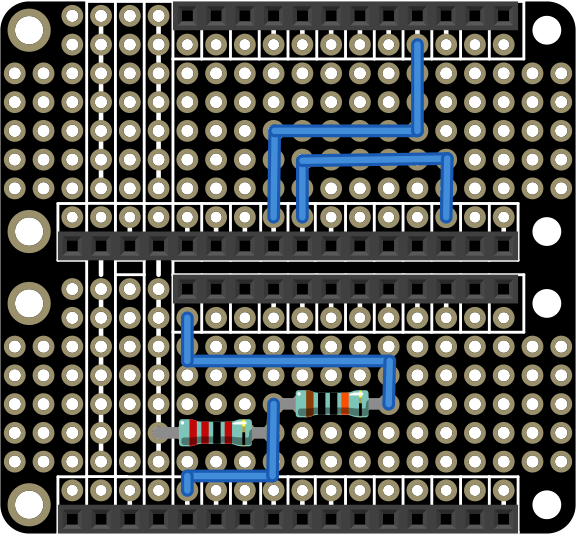

# ESP8266 based Arduino wardriving

## What is this?
A simple/~~cheap~~ hardware + software setup to do wardriving trips and store as much information as we can on a SD card, using a small Arduino box. This project was forked from reynico's arduino-wardriving project and adapted to work with the Adafruit ESP8266 HUZZAH and FeatherWings. This hasn't been tested yet and much of the content will be subject to change till the end of February 2018. The parts are on order. 
Part of the datalogging code stolen from [Sparkfun](https://learn.sparkfun.com/tutorials/gps-logger-shield-hookup-guide/example-sketch-gps-serial-passthrough) guys

## What do we need?
* [$19.95](https://www.adafruit.com/product/3213) HUZZAH ESP8266
* [$8.95](https://www.adafruit.com/product/2922) Adalogger FeatherWing - RTC + SD Add-on For All Feather Boards
* [$39.95](https://www.adafruit.com/product/3133) Adafruit Ultimate GPS FeatherWing
* [$14.95](https://www.adafruit.com/product/2900) FeatherWing OLED
* [$7.50](https://www.adafruit.com/product/2890) FeatherWing Doubler for hooking the circuit together
* [$0.95](https://www.adafruit.com/product/2886) Feather Female Header Set
* [$1.25](https://www.adafruit.com/product/2830) Feather Stacking Header Set
* [$0.95](https://www.adafruit.com/product/380) CR1220 Coin Battery for Holding GPS Ephermeris 
* [$9.95](https://www.adafruit.com/product/1781) Cylindrical Lithium Ion Battery
* [$2.95](https://www.adafruit.com/product/2671) 2mm Pitch Break-apart Male Headers
* One 22k Ohm Resistor
* One 100k Ohm Resistor

## What does this do?
* Checks for a working SD Card
* Waits for GPS signal
* Collects all WiFi signals on 2.4Ghz on every (configurable) GPS sample
* Stores this information as a CSV file

## What does this not do?
* This doesn't capture pcap files due power limitations
* This doesn't attack any network

## What does this need?
* Fix some race conditions
* ~~A PCB design that I'm working on~~
* A better antenna for GPS and WiFi, that will help to speed up satellite lock-up and enlarge WiFi coverage

## What is different in this fork 
* Used parts from one vendor, Adafruit, for the A E S T H E T I C. This eliminates need to make a custom circuit board as well.
* Took out previously recorded check, I felt checking to see if an AP was already recorded would become inefficient over time, so it was removed. 
* Put the output CSV into Wigle CSV format.
* Added way to verify we have a fix on GPS location. 

## What do you need to configure?
Nothing, but you can:
* Setup CS pin for SD card module on *ARDUINO_USD_CS* variable
* Change log file prefix and suffix on *LOG_FILE_PREFIX* and *LOG_FILE_SUFFIX*
* Remove or add columns to CSV datalog on *log_col_names*
* Define GPS log rate time on *LOG_RATE* (milliseconds)
* Define GPS TX/RX pins on *ARDUINO_GPS_RX* and *ARDUINO_GPS_TX*

## Electric setup
The diagram below shows how the FeatherWing doubler should be wired for this project.
 

The ESP8266 and GPS module should be stacked on the top portion and the Data Logger and LCD screen should be stacked on the bottom portion. 

